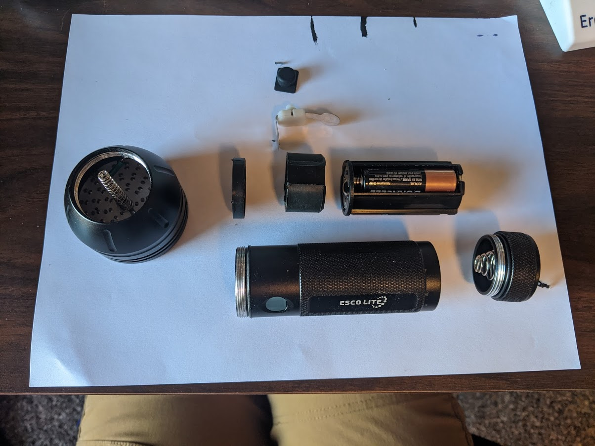
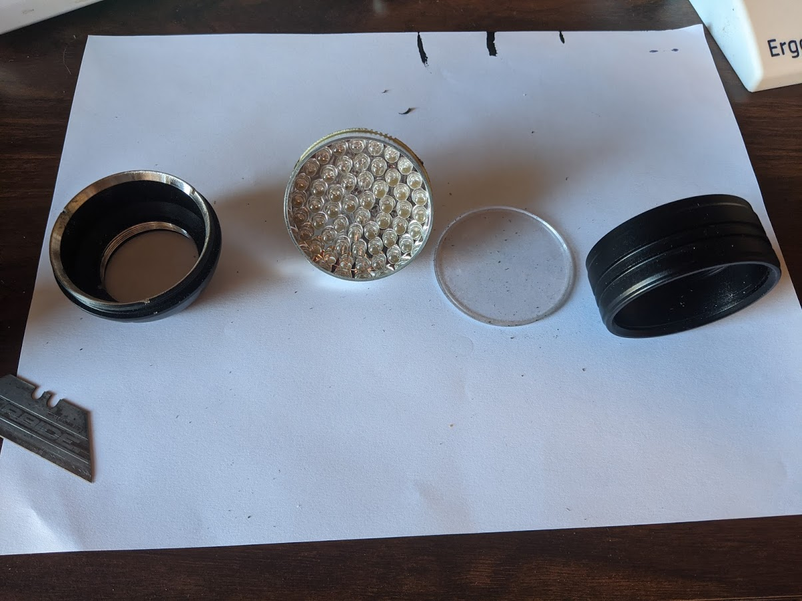
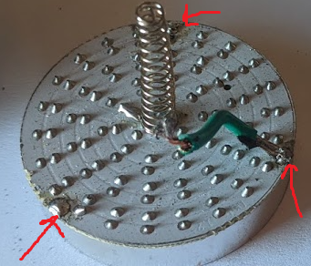
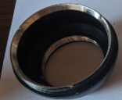
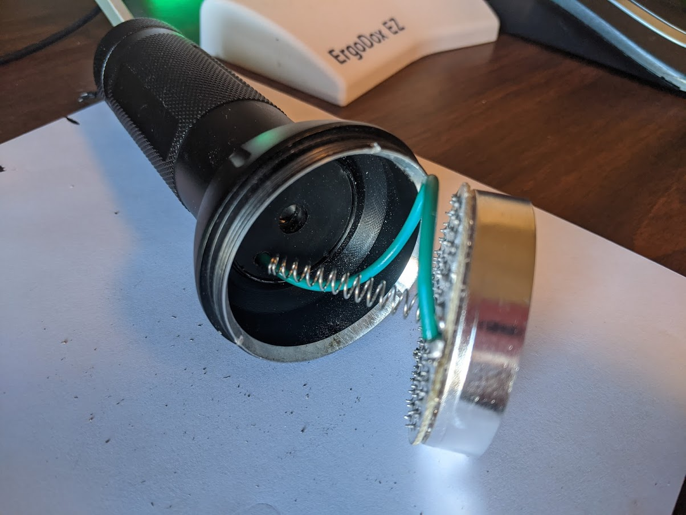

I bought a UV light ([link](https://www.amazon.com/gp/product/B008133KB4)). I use it to activate glow-in-the-dark disc golf discs while playing night rounds.

I was having some trouble with an inconsistent electrical connection and decided to poke around.

And the light housing also comes apart.

I was really impressed that the entire flashlight comes apart easily.

The issue is the connection between the cathode and the negative battery terminal runs though the flashlight body.

There is a weak point where the circuit board contacts the flashlight housing.

The three soldering points on the board 
Ignore the green wire. The solder points with arrows are meant to just touch the silver of the ring here.

When the flashlight is screwed together those there points are supposed to have enough contact to make an electrical connection.

I soldered a longer wire to the negative terminal. 

I drilled a hole though the body and was able to run a wire to the negative terminal of the battery pack. This unfortunately leaves some frayed wires (to make a better connection) in the battery pack area you have to bend aside to remove the battery.

--

I'm really happy with the fix. It solves the problem and the flashlight is still water resistant. All of the changes are 'inside' the o-rings.
