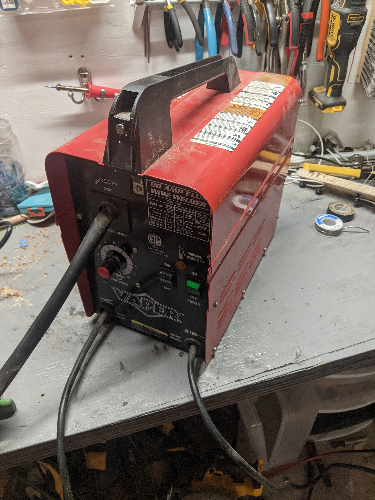
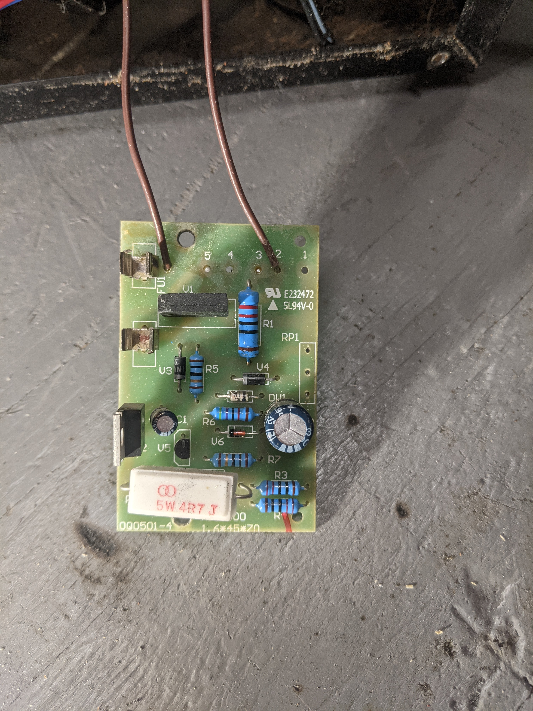
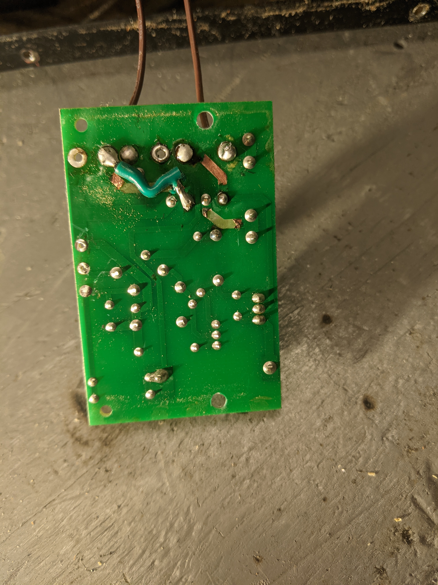
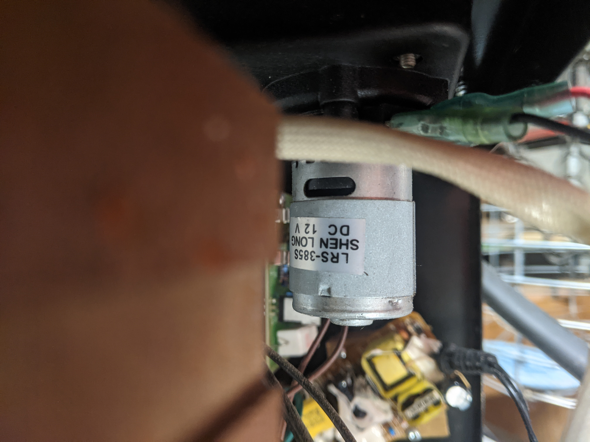
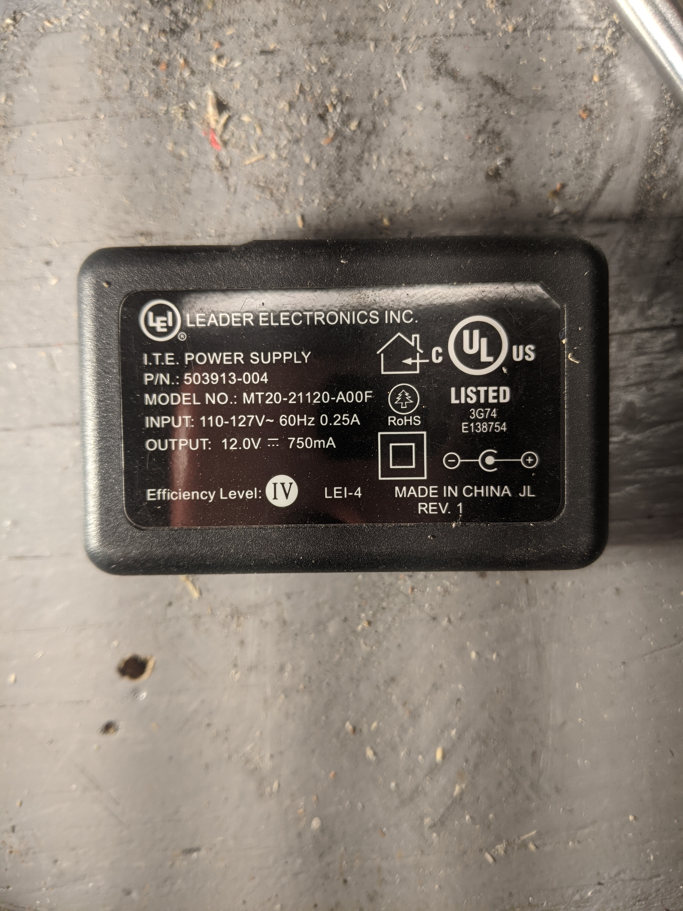
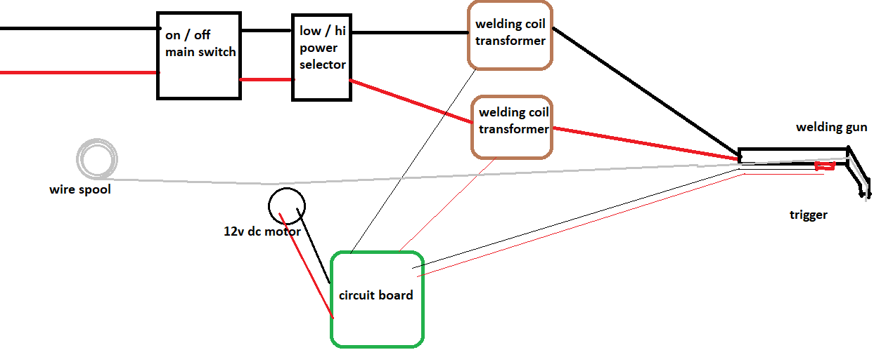
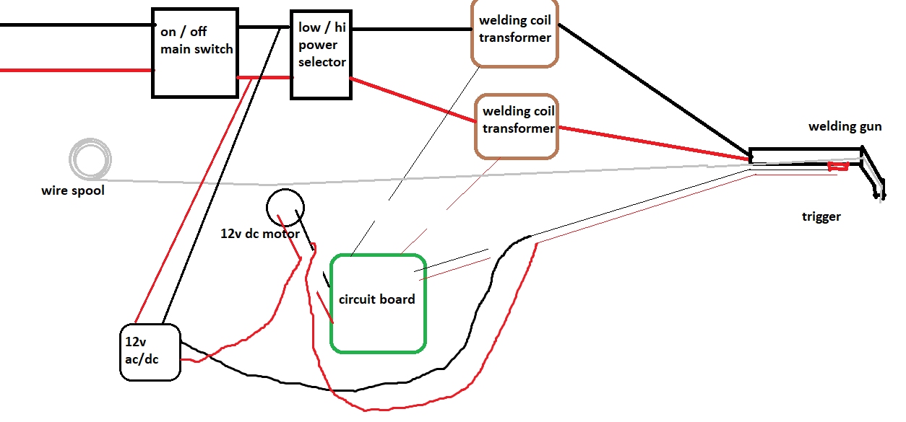
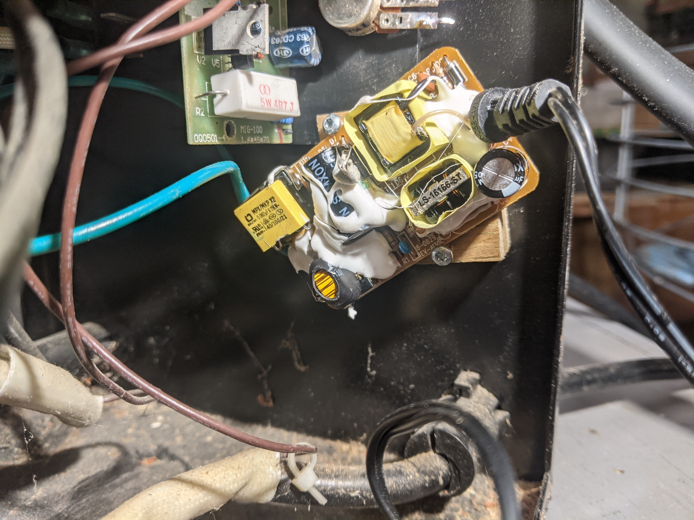
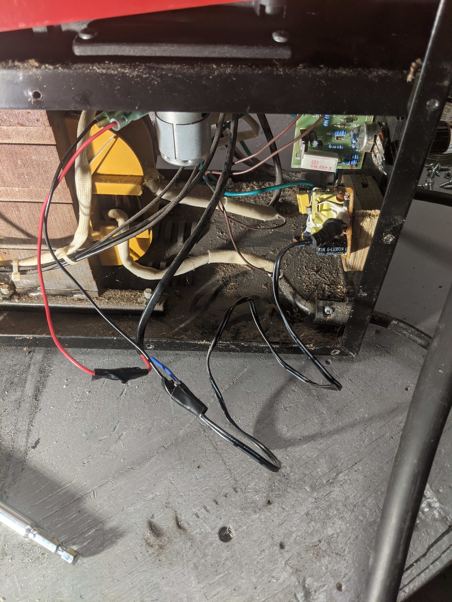

My cheap Craigslist welder broke.  

Specifically the wire feed circuit blew.

The fuse blew as well as one of the traces on the board. Here I replaced one of the traces but as I replaced traces others blew.

Unfortunately the welder is too cheap to be worth spending time and money to fix it properly. The welder I was about to buy as a replacement is $600. So it *is* worth the time to try to get a stop-gap fix is place.

---

After some testing it seems the button in the welder handle is working. The motor for the feed mechanism also appears to be working.

Luckily the motor had some specs printed on it. 

I found a 12v wall adapter in the trash and decided to give it a shot.  I was fairly sure the motor wouldn't draw more than 750mA and decided to risk it.

The original circuit design on the motor is relatively simple. 

Modifying to use my own power adapter was easy. I disconnected the handle's button from the circuit board and wired it to adapter. I desoldered the motor and wired it into the switch and adapter.

This unfortunately leaves out the wire speed potentiometer. The circuit board had a potentiometer to change the wire speed from 0 to 10. I originally wired in my circuit, but it didn't work very well (0-7 and the wire did nothing. 8-9 and the wire moved slower but the potentiometer was smoking, 10 and it worked fine)

I assume the wire speed was controlled through some type of PWM controlled in the circuit board. Not a direct resistance potentiometer. I took it out of my circuit.

I screwed the adapter to the welder case. 
The case is ready to reassemble. 

--

The final solution is far from ideal. I lost wire speed control. Fortunately my welding needs are very basic and I hope to survive on this welder for a few years.

