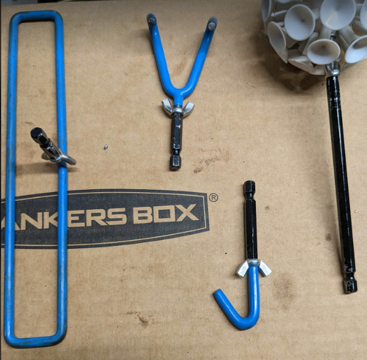
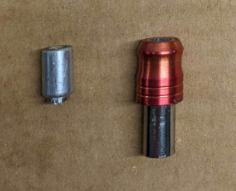
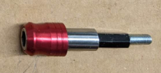

I recently made a system for quickly switching my disc golf retreiver accessories [link](/quick-switch-disc-golf-retriever). My Rogue Iron retreiver seems strong and I've never had issues with it - but I have seen other retrievers break before. I wanted to run some numbers and see how much extra stress I may be putting on my retriever with my change.

<!--more-->

I started by weighing each of my retriever accessories. I weighed the wingnut which comes with the RogueIron accessories to compare:

| | Base Weight | With Wingnut |
Single Hook | 9.8g | 13g |
Double Hook | 24.8g | 28g |
Mailbox Slot | 63.8g | 67g |
SuctionCup Ball | 63g | 66.2g |

When I made my accessory adapters I made each one a different length (weight). I weighed each adapter I had made

{:style="display:block; margin:auto;"}

| | Shortest | Medium-Short | Medium-Long | Long|
Adapter Weight | 4.6g | 7g | 10.4g | 30.7g |

From there I calculated the weight of each accessory using the shortest and longest of the adapters:

| | Base Weight | With Wingnut | With shortest adapter | With longest adapter |
Single Hook|9.8g|13g|17.6g|43.7g
Double Hook|24.8g|28g|32.6g|58.7g
Mailbox Slot|63.8g|67g|71.6g|97.7g
Suctioncup Ball|63g|66.2g|70.8g|96.9g

I also need to add the added weight of the adapter I put on the retriever itself.

My original retriever modification was permanent unfortunately. However - this means I removed 2.4g from the original retriever before adding 15.6g (+13.2g).

    
    
        The part on the left is what I cut off of the original RogueIron retriever. The part on the right is what I added by cross-drilling a hole and pinning with a cotter pin.
    

    
I've made another adapter which should work without modifying the original retriever. It weighs 22.7g. I think I can make the shaft a little shorter - hopefully getting the weight closer to 15g.
    
    

 
This gave me some final results on how much each accessory might weigh with with the heavier (non-destructive-install) retriever adapter. For this I only worried about my shortest and longest accessory adapters.

| | Short Adapter | Long Adapter |
Single Hook |40.3g | 66.4g |
Double Hook |55.3g | 81.4g |
Mailbox Slot |94.3g | 120.4g |
Suction Cup Ball |93.5 | 119.6g |

Seeing over 100g does have me slightly worried about the health of my retriever. A typical disc golf disc weighs around 170g. So I wanted to see how much relative weight increase each accessory might cause.

| | Short Adapter | Long Adapter |
Single Hook |23.71% |39.06%|
Double Hook |32.53% |47.88%|
Mailbox Slot |55.47% |70.82%|
Suctioncup Ball |55.00% |70.35%|

The heaviest accessory (mailbox slot) with the heaviest adapter (the long one I use on the suction cup ball in the above images) means the retriever will have 71% more weight on the tip that with just a disc. Putting the accessory an extra 6" further out has some reach advantages - but does make me worry about the force being even higher for the retriever.

On the other hand. When my retriever is at its fullest length I almost never need to fully support the disc's weight. I usually will only need to drag it closer into 10' range where I use the accessory to actually pick up or fling the disc to me.
