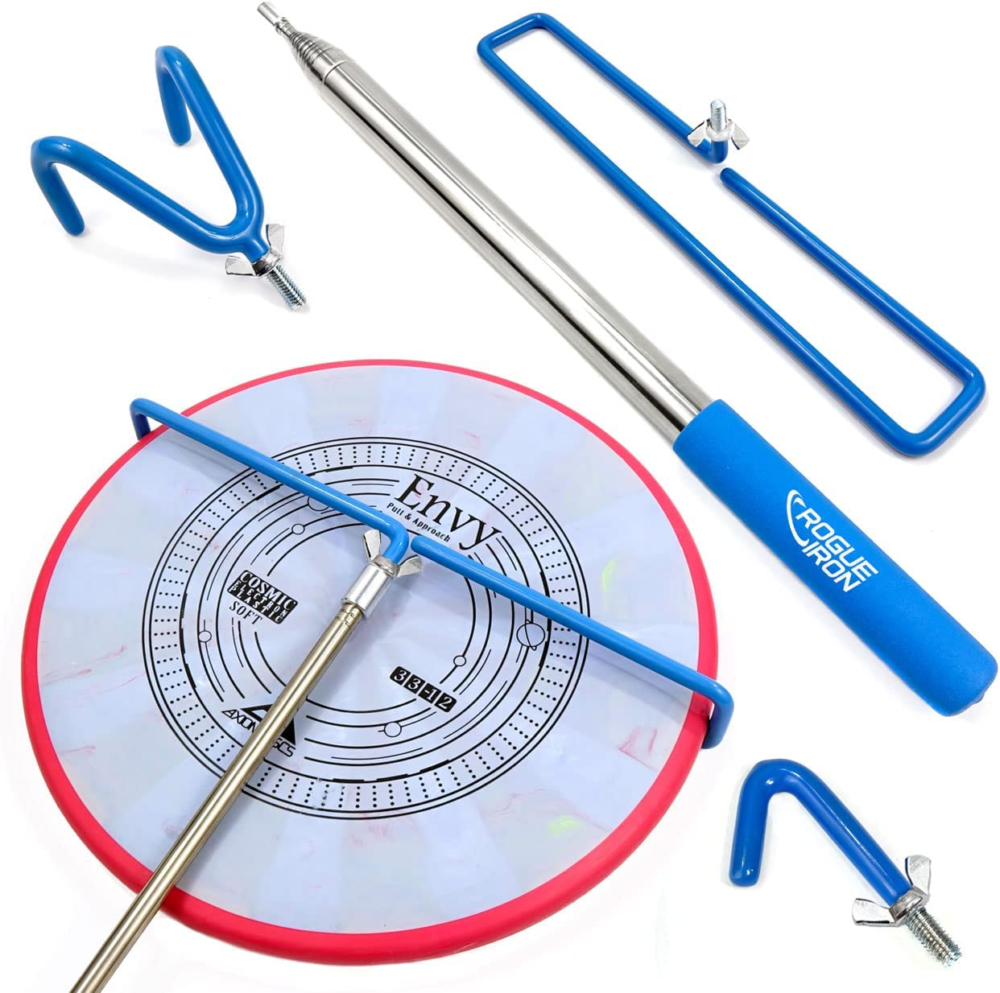
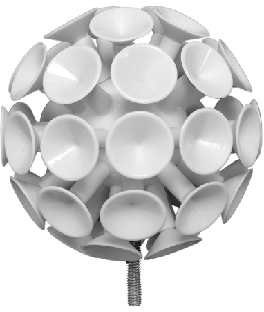
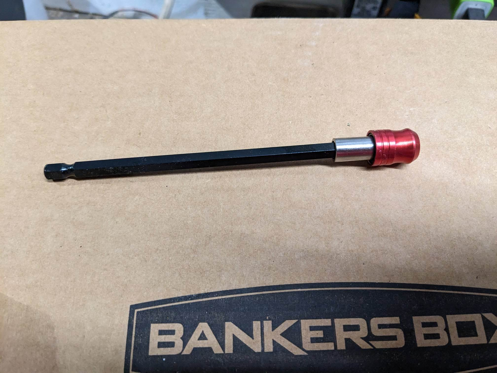
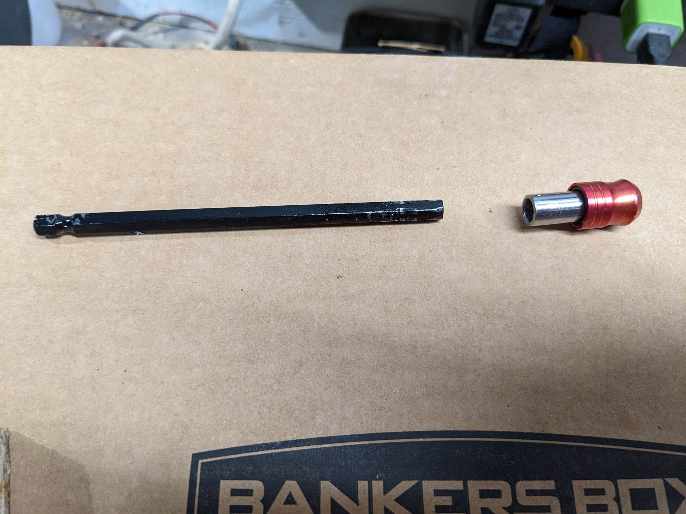
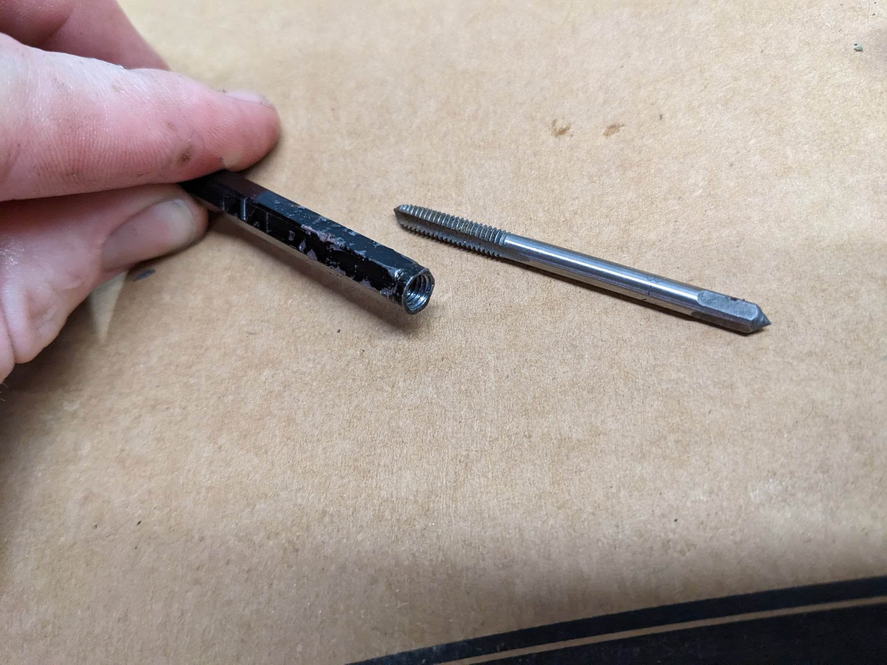
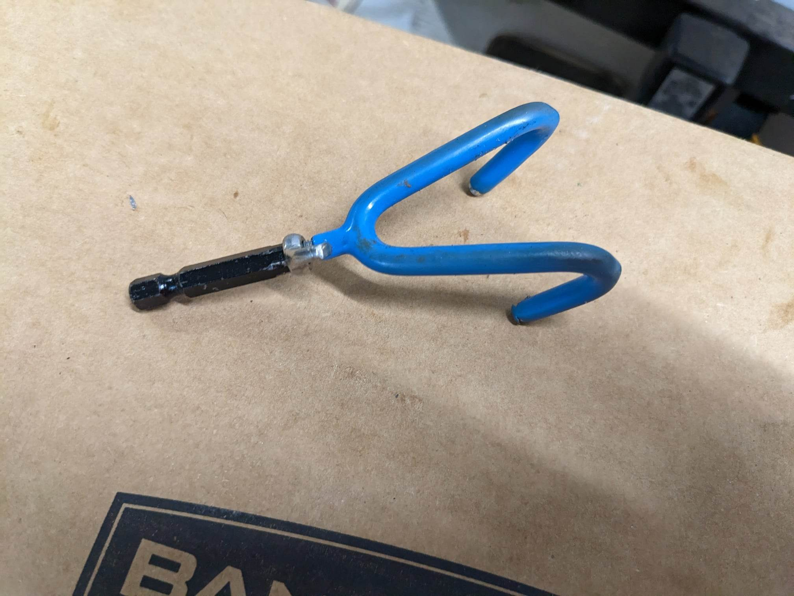
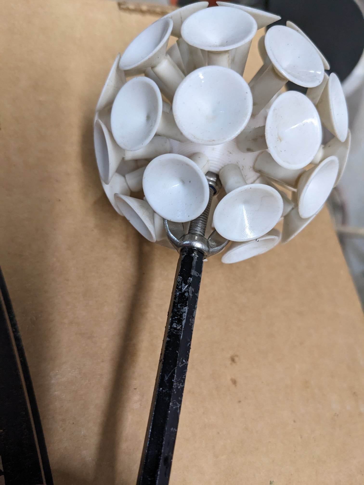
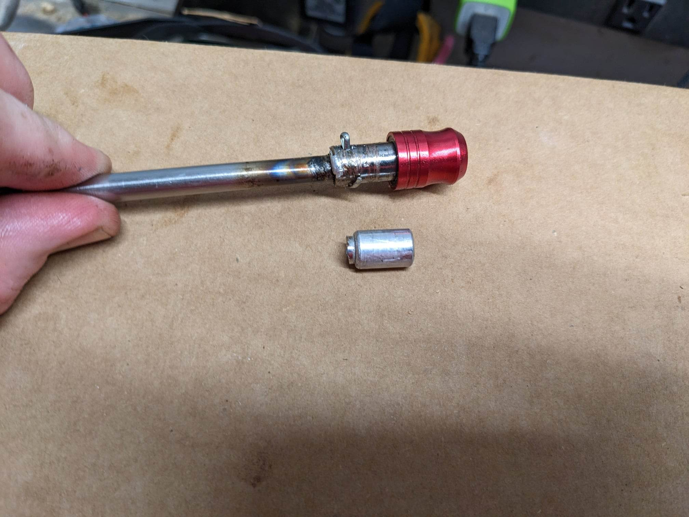

I play disc golf - and sometime lose discs in the water or up in trees. I've owned a few disc retrievers and recently bought a "Max Disctance" suction cup ball. It works really well in the water, but isn't really designed for everything. The problem is that switching between the hook type retriever and the Max Disctance is a little tedious.

This is how I came up with a quicker way to swap accessories

<!--more-->

[Any Amazon links below may be affiliate links]

The disc golf retriever I own ([link](https://www.amazon.com/gp/product/B08XNZQ8MX?ie=UTF8&psc=1&linkCode=ll1&tag=charliewynn-20&linkId=b57197751198ea705f1d78511bee22dc&language=en_US&ref_=as_li_ss_tl){:target="\_blank"}) comes with a few accessories. Two hooks and a "mailslot".

{:target="\_blank"}

While playing a few weeks ago I noticed someone pulling their disc out of the water with a "Max Disctance" suction cup ball ([link](https://maxdisctance.com/){:target="\_blank"}). I bought one and was instantly impressed.

{:target="\_blank"}

---

After some brainstorming I decided that a locking hex shank bit holder would meet my needs - I ordered a cheap set on Amazon ([link](https://www.amazon.com/dp/B097R4PZQK?psc=1&linkCode=ll1&tag=charliewynn-20&linkId=428bacaf360cec18fb06eae554c81d1e&language=en_US&ref_=as_li_ss_tl){:target="\_blank"})

{:target="\_blank"}

With some effort I was able to remove the shank. I tried a few methods but it was hard to not marr the surface. If this initial prototype works well I want to buy a few different types of hex shank extensions and see which one is the easiest to modify. 

I bought a cheap tap and die set for 5mm x 0.8mm ([link](https://www.amazon.com/dp/B098K2WRH6?psc=1&linkCode=ll1&tag=charliewynn-20&linkId=c08e784bf993940915464cd83c8486f2&language=en_US&ref_=as_li_ss_tl){:target="\_blank"}). This size matches the retriever and accessories' threading. I drilled and tapped a hole in the shank.

{:target="\_blank"}

I only made two threaded hex shank adapters for this test. Now I can attach any two accessories to the hex shanks.

 | 

---

All that is left is to attach the female portion of the hex shaft extension to the tip of the retriever. I'm not super satisfied with the first attempt. I tried to thread the outside of the retriever tip and inside of the hex shank. But the hex shank felt too hardened for my taps. I drilled out the hex shank extension and cut off the tip of the extension so it would be a slip-fit. I tried using plumbing solder to attach them with limited success (I'm remodeling our shower and had the soldering supplies out already). It was getting past 1am and I decided to just cross-drill and use a cotter pin.

It's not elegant but it works!

<iframe width="100%" height="420" src="https://www.youtube.com/embed/JtFd0csIyUk" title="Quick Switch disc golf retriever attachment" frameborder="0" allow="accelerometer; autoplay; clipboard-write; encrypted-media; gyroscope; picture-in-picture; web-share" allowfullscreen></iframe>

I had some concerns about the weight of the quick switch adapters and did a little investigating into that on this related page: [link](/quick-switch-disc-golf-retriever-weight)
