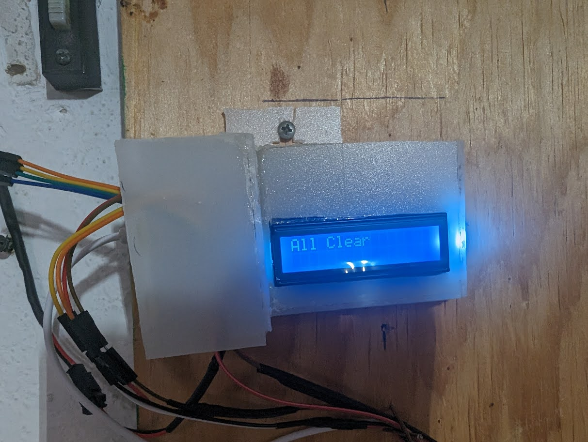

A door leads from my kitchen to my garage.
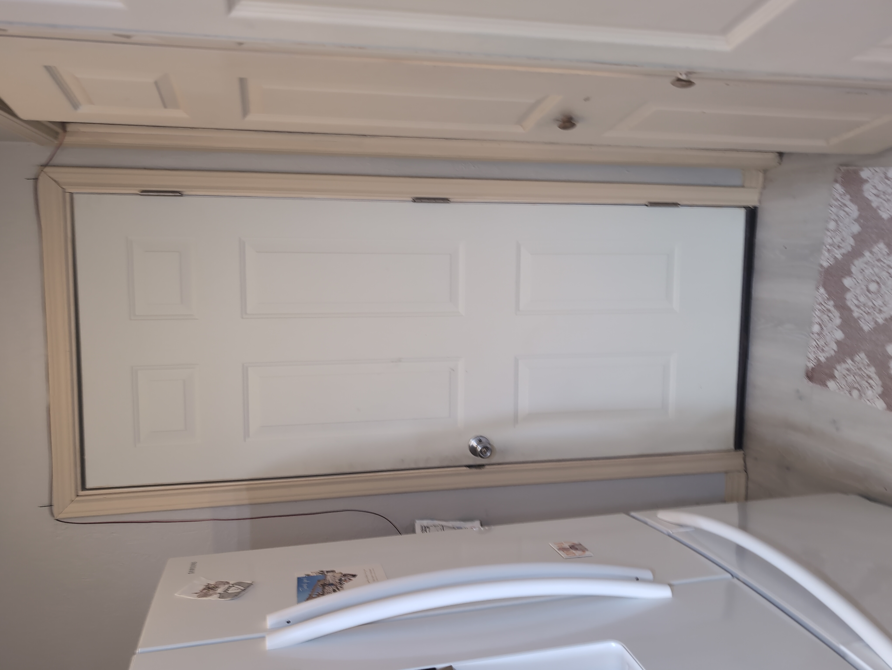

I spend a lot of time in my garage tinkering - and going in and out of that door to the house.

Unfortunately a collision occurs <!--more--> when I open that door if my wife has the left the bi-fold door to the laundry closet, or the right refridgerator door, or either of the two nearby drawers open.

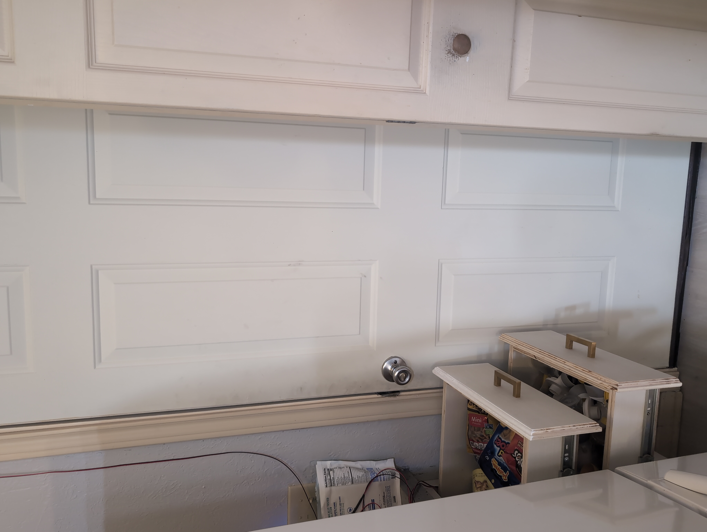

My inlaws had just gotten me a raspberry pi pico for Christmas. I bought an arduino beginners kit which contained an LCD screen and a few sensors. I originally just planned to use some `and` gates and LEDs but the pico and LCD screen were a little more exciting to start playing with.

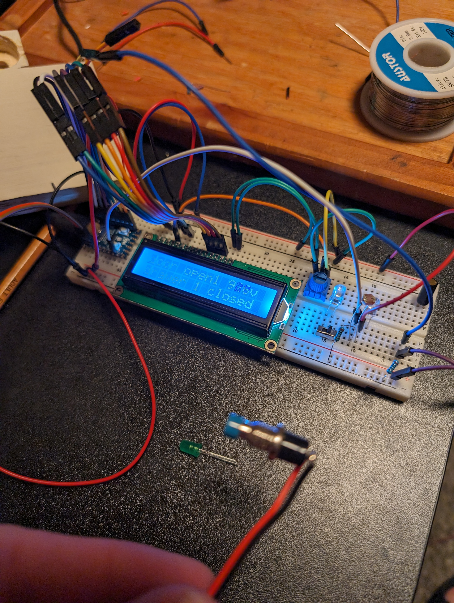

After playing around for a few hours I had a prototype on breadboards. I had been watching some [Ben Eater breadboard computer tutorials](https://www.youtube.com/playlist?list=PLowKtXNTBypGqImE405J2565dvjafglHU){:target="\_blank"} and had never thought to break out sub-modules of circuits for a single project to separate boards. Watching those videos along with maturing as a software developer has me thinking more about separating testing data (sub-board with switches) from real data (sensors installed in my house). None of this is really complicated enough to where I would normally separate things out. But I went ahead and it was almost immediately useful. I think I normally don't know when to make the switch to laying things out nicely versus quick and dirty.

I used a simple push-button momentary switch I had bought in bulk for another project for the drawers. I drilled a hole in a piece of plywood which held the button just above the surface. It was counter-sunk on the back-side to hold the button-housing. I mounted this behind the drawer and cut another piece of plywood the right thickness to just hold the switch closed when the drawer is closed

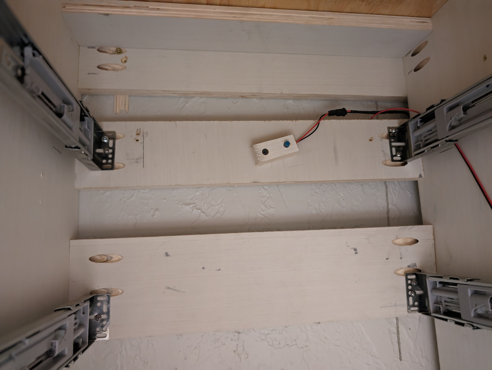
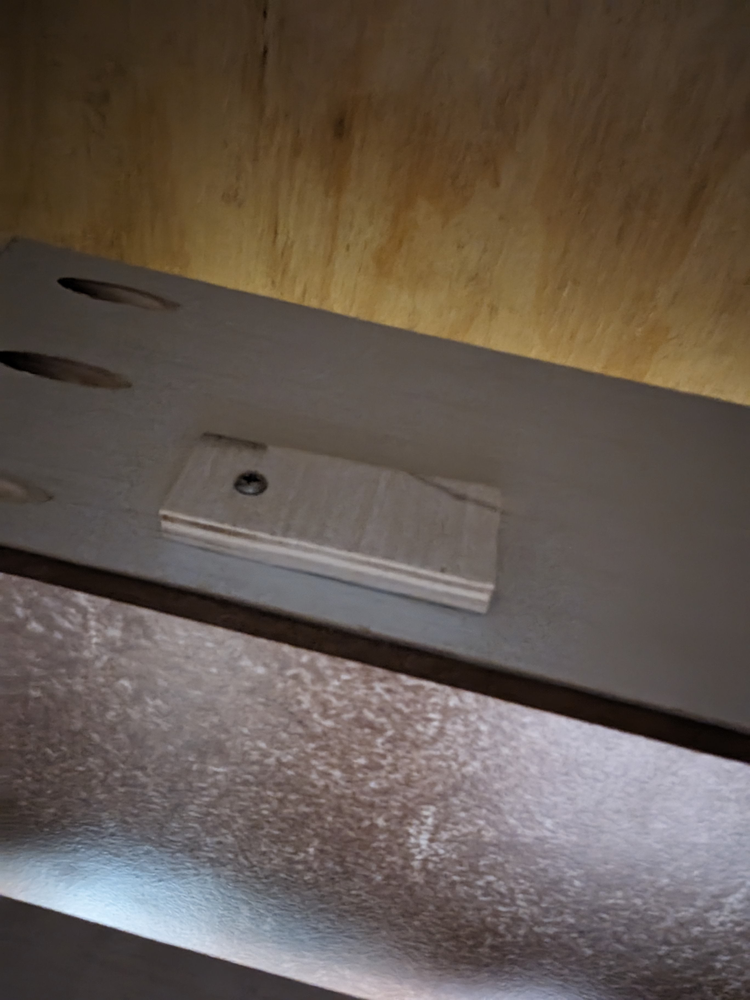

For the bi-fold door to the laundry room I used the tilt sensor from the Arduino basics kit. A string attached to the door is pulled just enough to swing a piece of plywood which holds the tilt sensor to detect when the door is opened significantly.

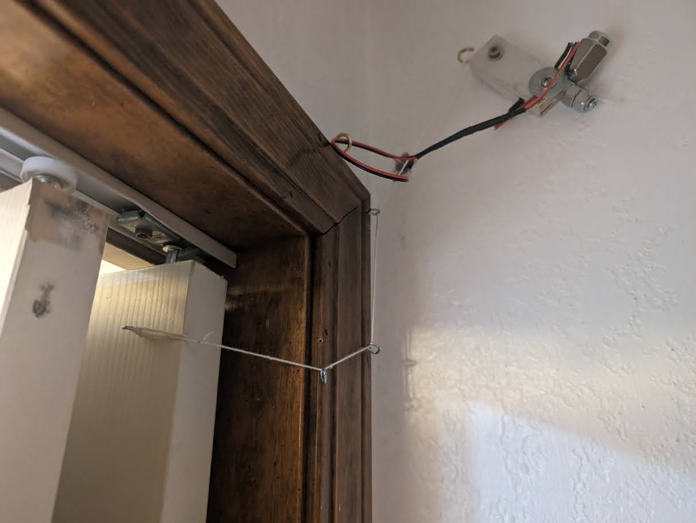

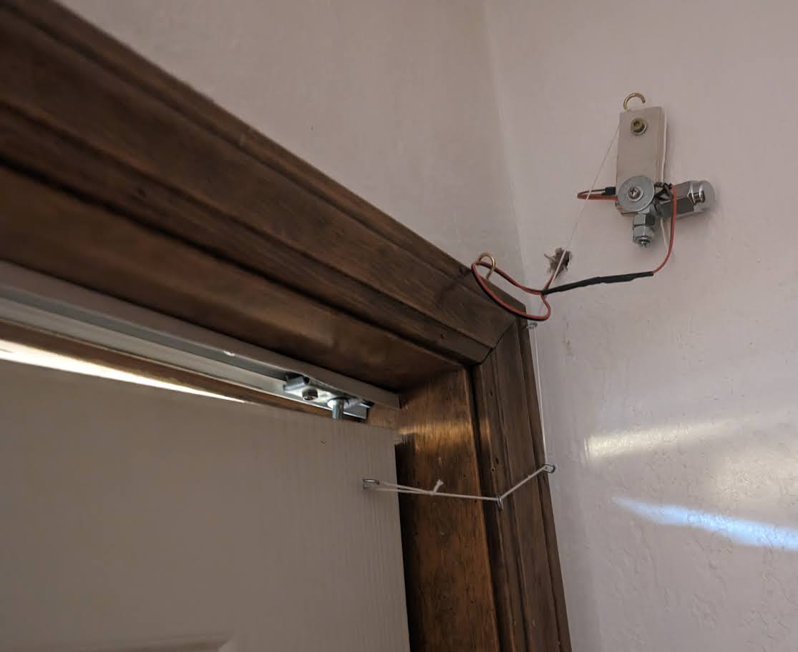

You can see as it goes between opened and closed the tilt-sensor is activated (take my word for it). The signal wire was effecting the swinging too much so I had to add a lug-nut and some machine nuts to help weigh it down and keep the swing consistent.

This feels like the weakest link of the system. After doing the refrigerator sensor I think I would use a hall sensor for this door as well.

For the fridge I noticed my house had some security sensors on the windows which we never used.

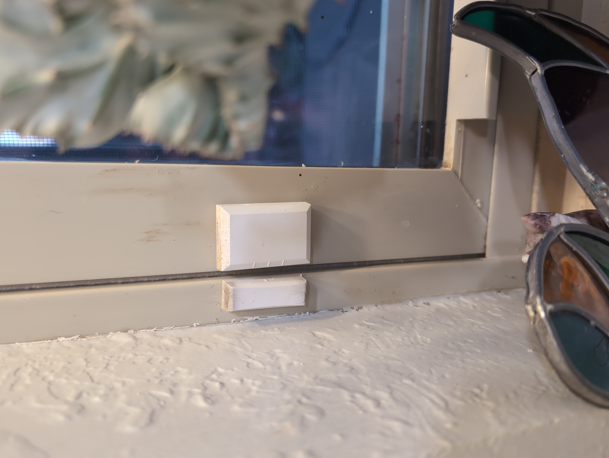

I opened this up and soldered to the little hall sensor inside the unit. I then hot-glued it to the top of my fridge just above where it's built-in magnet actived its own door sensor. It's mounted in just the right spot to pick up when the door is opened.

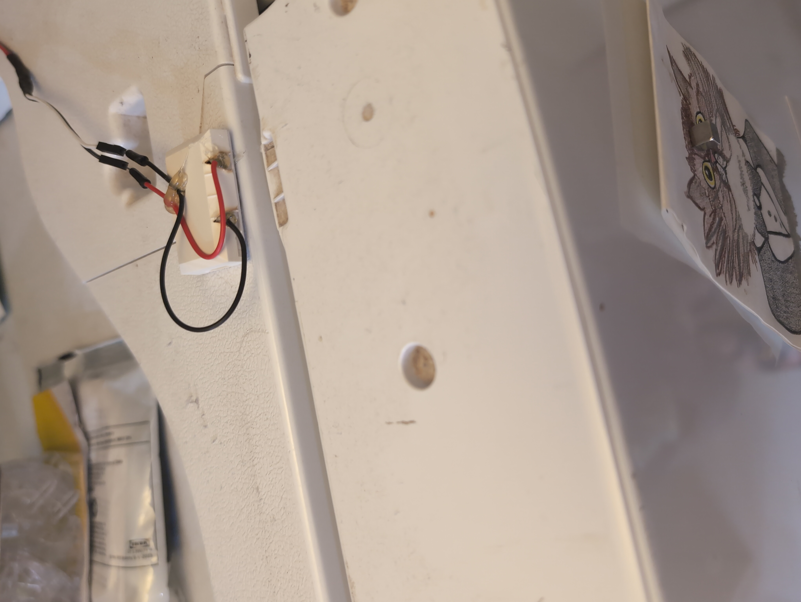

With these inputs I can detect if the left laundry room door - the right fridge door - or either drawer are opened.

I put each of these as separate inputs into the pico and wrote some code ([Click here to see the code on github](https://github.com/charliewynn/garage-kitchen-monitor/blob/main/kitchen_garage_door/kitchen_garage_door.ino){:target="\blank"}).

A red LED will give me a general "good/bad" before I open the door and crash into something. And the LCD gives me a bit more detail. I also include how many seconds/minutes/hours a sensor has been activated. If I notice the laundry room door has been opened "20m" or "2h" I'll just open the door slowly and squeeze my way around. If it says "25s" I'll assume Leah is in the middle of something and wait it out. At least that's the idea..

To alert the person on the inside if anything is open I also hot-glued a red-LED behind this empty spot on the kitchen light-switch plate.

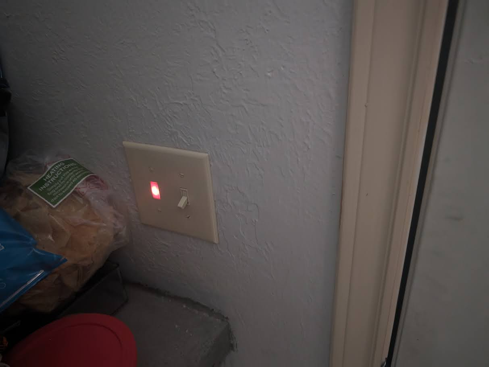

I have a big sheet of white translucent plastic I took from a broken big-screen TV my neighbor was throwing away. I sloppily dremeled out a case and hot-glued everything together. You can really tell where my energy ran out on this project :)

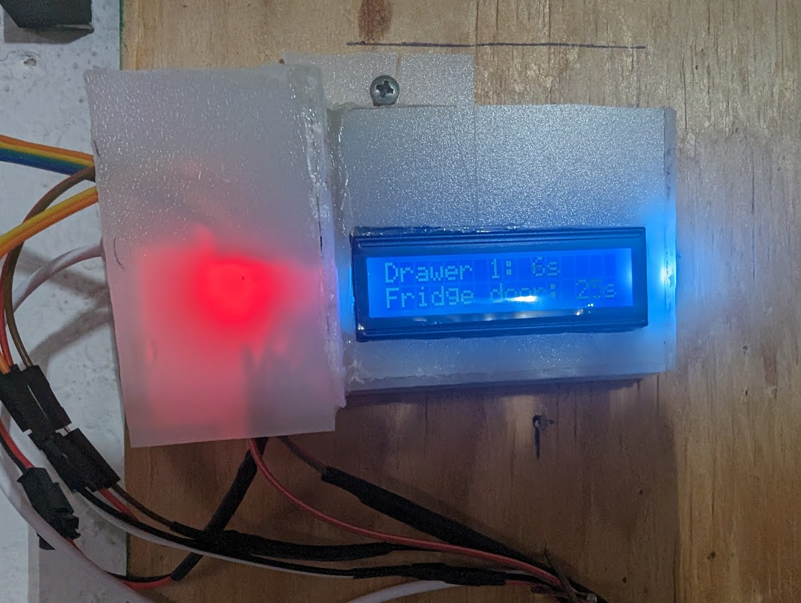

