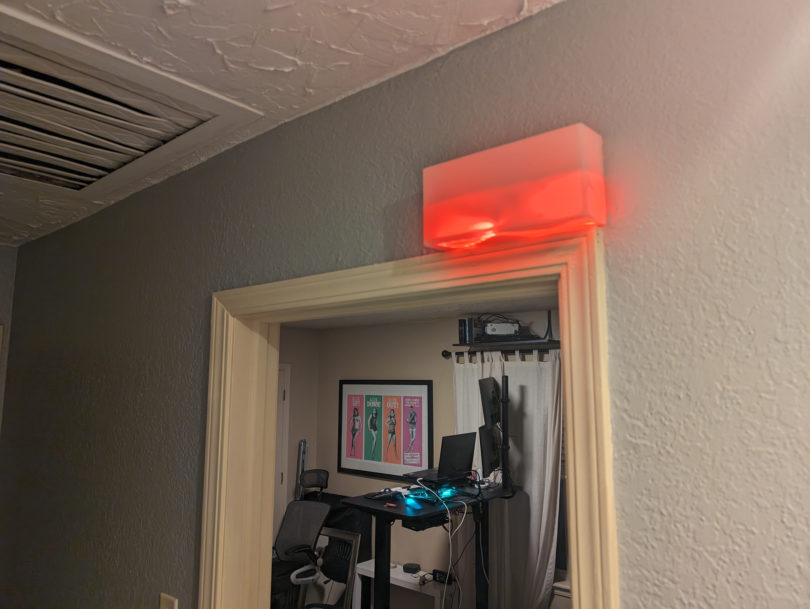
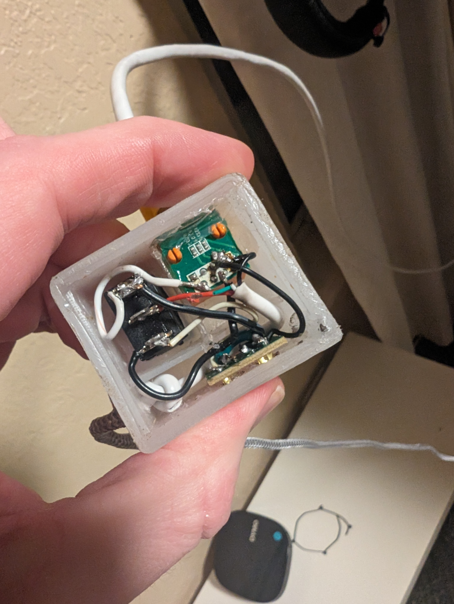
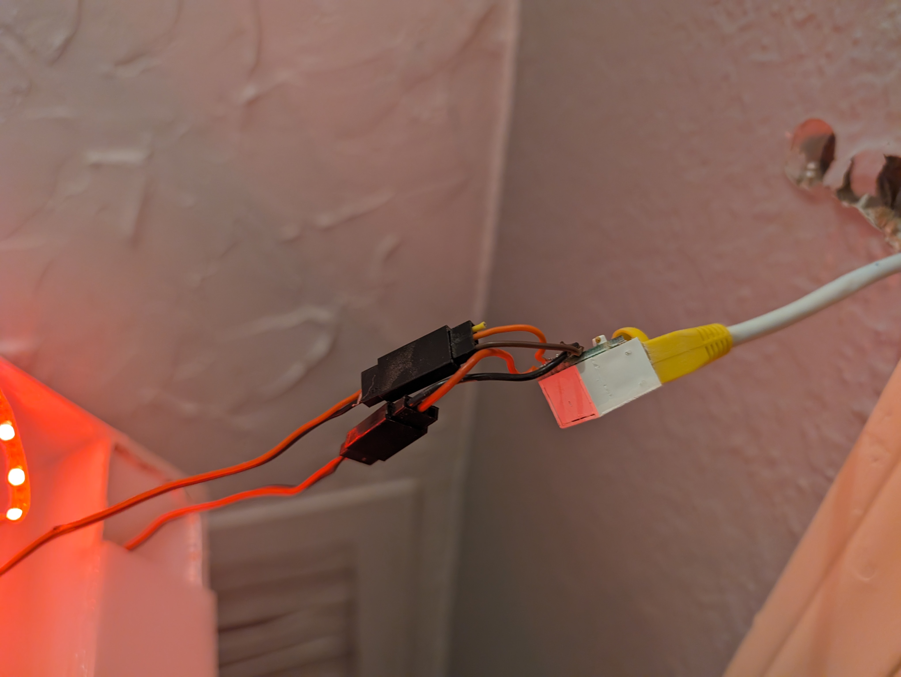
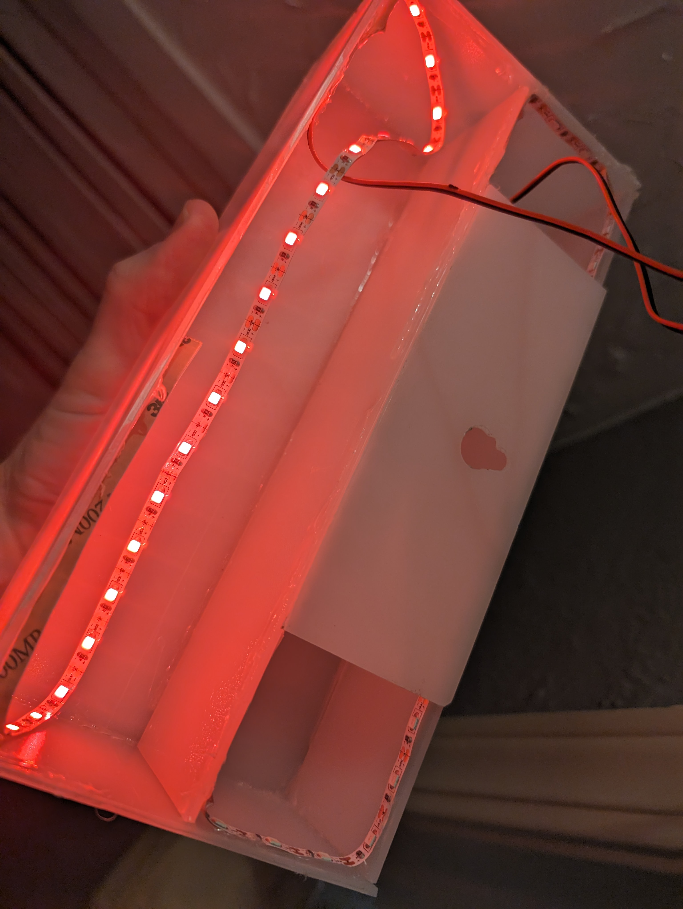
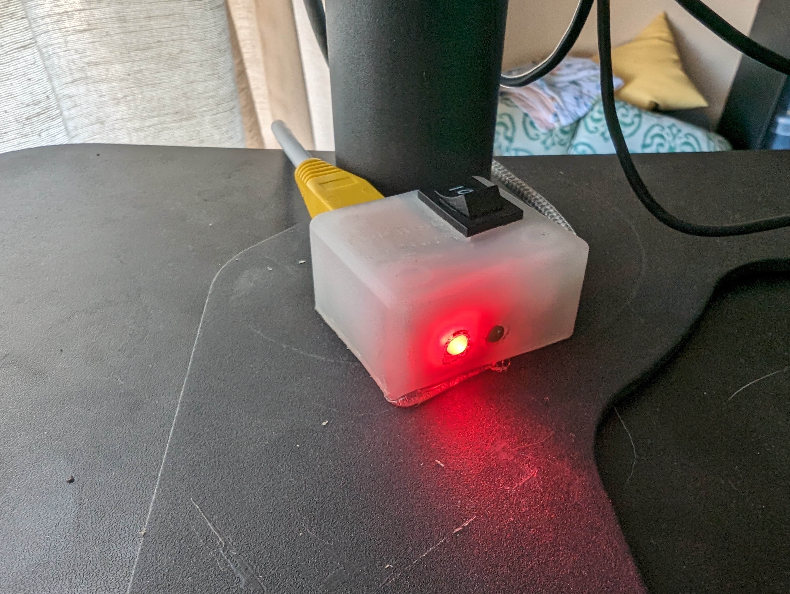
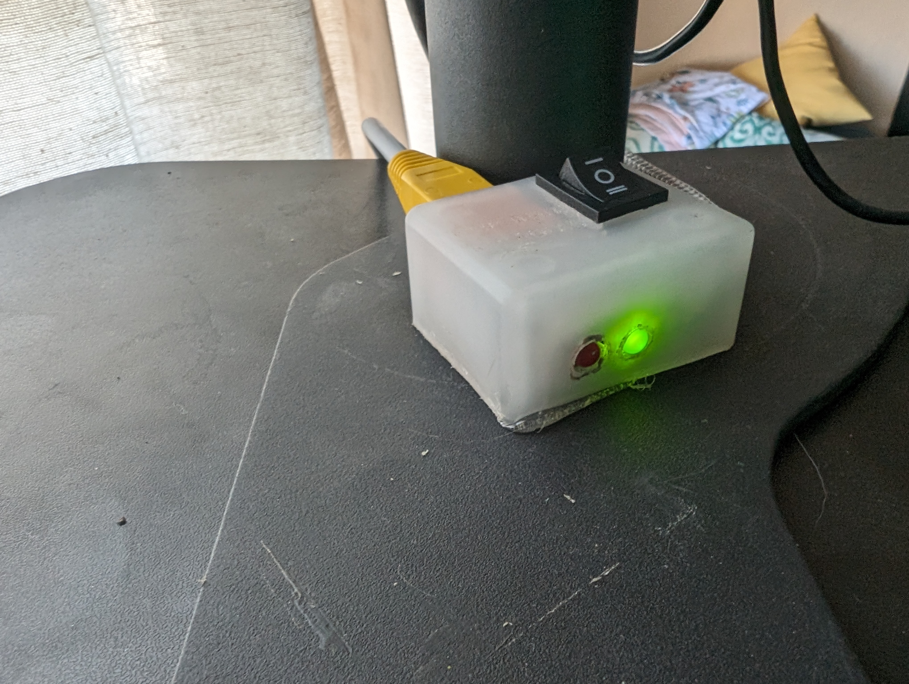

I work from home. So does my wife. We're both pretty respectful of each other's office space. But sometimes you're in a meeting or doing some high-concentration work where you really can't afford a distraction. <!--more-->

I had heard of work-from-home "on air" lights but wanted to make my own.

I took an old router apart and de-soldered two ethernet ports. I then picked two pins for ground and 5v+ to run my custom "POE" over any ethernet cable.

The braided cabel goes to a USB-A port for power.

Depending on my office layout I custom-make an ethernet cord for whichever length suits my needs. I run this cable across the room, under the baseboard. Above the door I drilled a hole in the drywall to feed it to the other side.

The translucent white plastic is the back panel of a TV my neighbor was throwing away.

I added status lights to the switch box to help me remember to not leave it on all day :)

