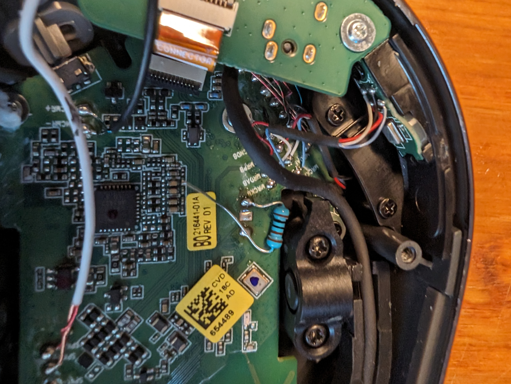

My day-job provided a bluetooth headset. I like that it will connect to my work pc as well as my phone. So I can listen to music from my phone, and it will also pick up notifications from my pc. And auto switches to the PC for meetings.

My issue with it is that when you take the headphones off it will pause whatever you're listening to. It works well until you wear the headphones with a beanie. Then the auto-pause triggers randomly.

I wanted to fix this.

<!--more-->

It was a little tricky to figure out how to open the headset. But afterwards I was able to decide which side (left or right) controlled the auto-pause.

Then from that circuit board I found 3 pairs of wires into the earphone assembly.

The PCB clearly labeled SPK+ and SPK-. But the other two pairs were a mystery.

After playing with my multimeter I found the wire pair. If I test the resistance with the earpiece un-covered I get no load. When I put my hand over the sensor it's around 950 Ohms.

I de-soldered the wires and used some heat-shrink tubing to keep the ends covered. Then a quick 1k resistor between the pins on the PCB and everything works as I hoped!

I cut off the long resistor leg and got the headset put back together.
