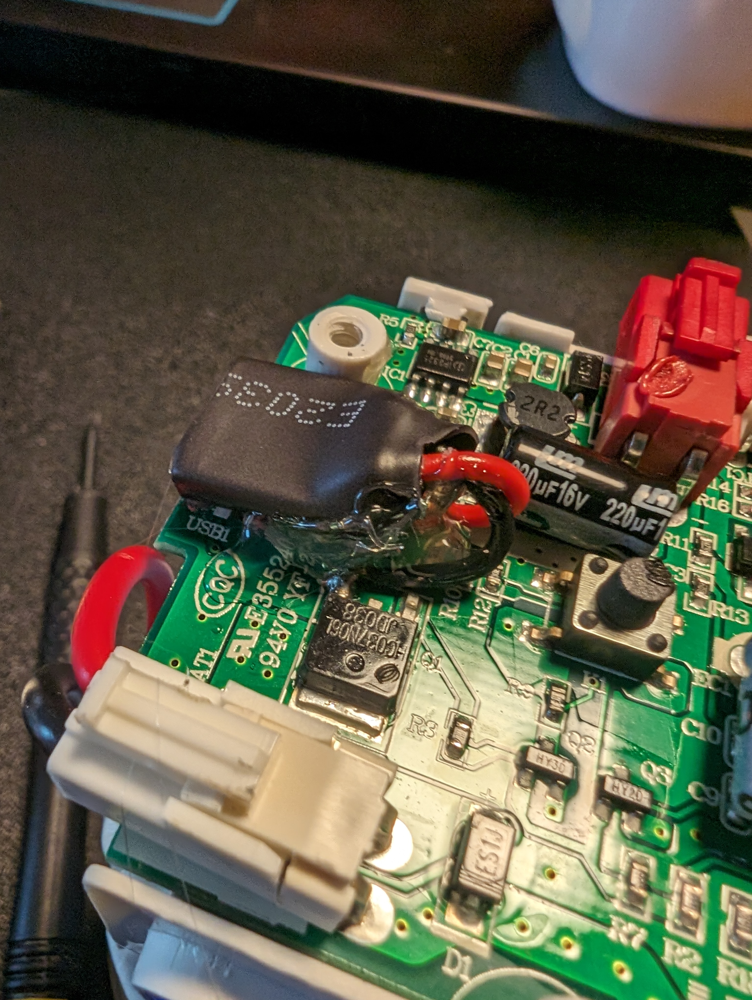
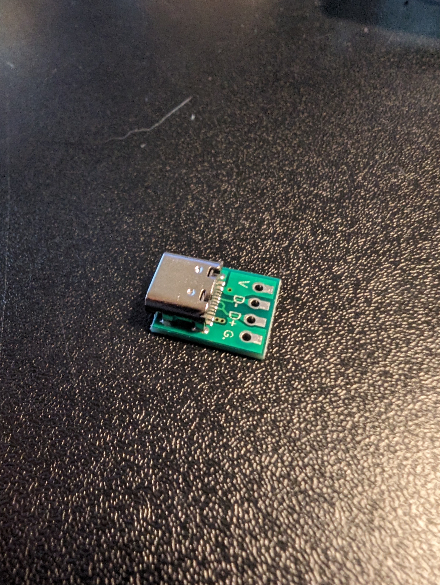
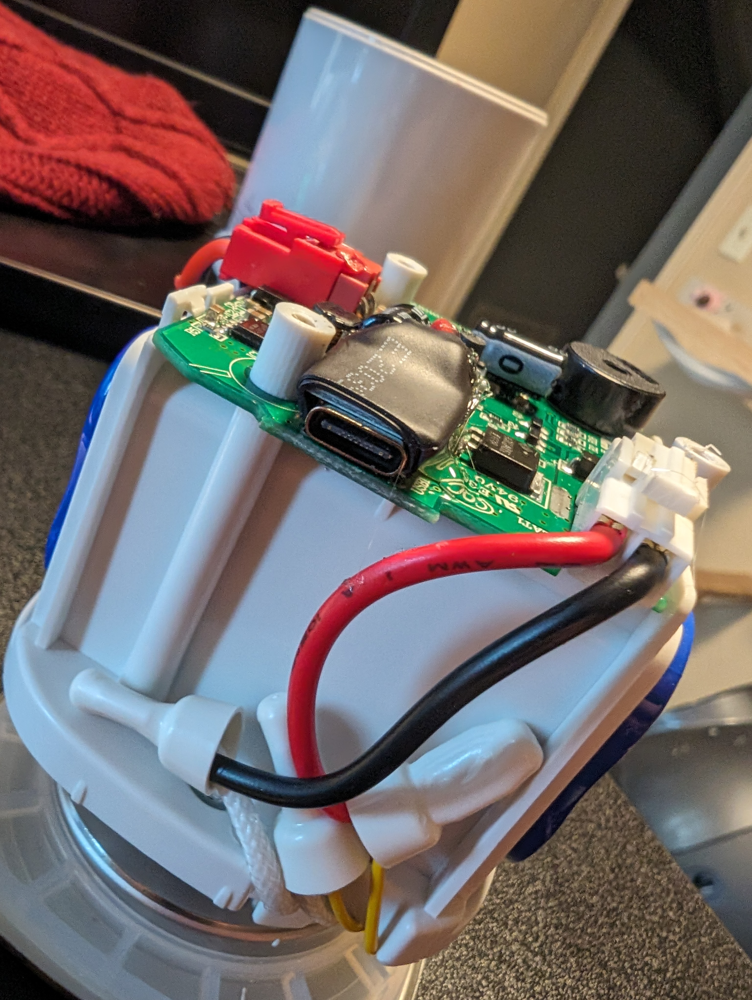

We had a baby! Itsagirl.

And we're frugal. We got a free portable bottle warmer (a Baby Brew) from a friend's sister who was done having kids.

Unfortunately I couldn't get it to work...

<!--more-->

We actually had a cheap bottle warmer which was a registry item. But eventually wanted to play with the portable one. It's about $100 new, but feels very nice (i.e. it's heavier than it looks).

I spent a long time looking at the PCB, testing capacitors. Looking up chips' datasheets.
Digging around with my multimeter I was really struggling to find anything wrong.

After way too much time I realized that power doesn't actually make it out of the usb-c port!

I soldered on some leads and put 5v to it and things seemed to work. I let it charge up and sure enough it works!

I bought a usb-c breakout board for power and was able to solder it in.

Unfortunately I was a bit confused on how USB-c power delivery works. The breakout boards I bought don't handle the usb-c protocol. So it has to use a usb-a to usb-c power cord (you can't use a usb-c to usb-c cable).

