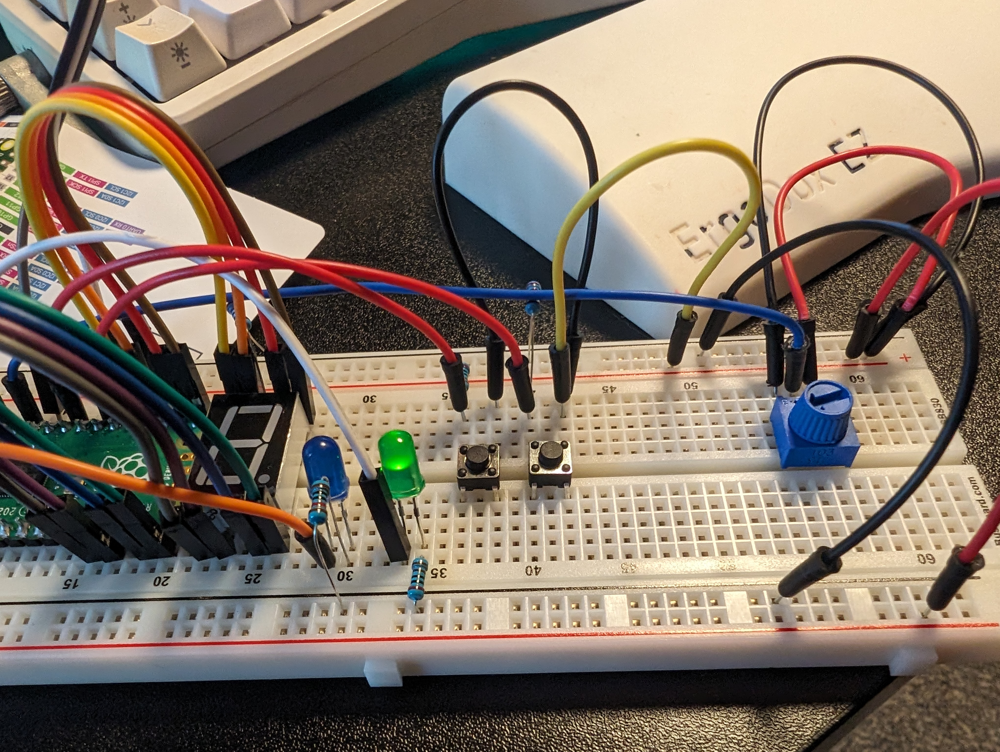
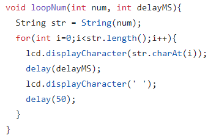

It usually freezes in our town a few times a year. Sometimes for a day or two, sometimes for a week.

Some of our pipes freeze if it stays cold enough for a few days. It's usually something that a space heater can fix.

Only rarely has it been bad enough to burst a pipe. However our washing machine's drain tube will sometimes freeze. Then when the washing machine tries to drain it will overflow and spill out over the kitchen floor.

It happened three times this year before I decided to do something about it. <!--more-->

I had the idea to make a microcontroller project to at least prevent some of the possible damage. Like many of my projects I didn't take too many pictures along the way.

What I came up with was a water level sensor which I'll put in the drain tube. And a relay to control power to the washing machine. When the sensor detects water it will cut power to the washer.

I first made a relay box which plugs into the wall and supplies a 120v outlet as well as a 5v/ground and sensor connection.

I originally hoped to fit everything in one project box. But ended up taking three due to how poorly my wire management was.

I do like that the power box is self-contained and could be used for a separate project (turns out you can buy relay controlled outlets which would have saved a lot of time. But I'm glad I made one myself just for the exercise).

A previous project I used had a 2x16 character LCD. However I was trying to make this project with parts I had on-hand. So I made the UI a single 8-segment display.

I needed a potentiometer to adjust the cutoff threshold on the fly. Because I only care about a discrete "wet/dry" condition I think I could do some testing and "hard-code" a resistor for this setting. But the potentiometer will let me make changes if a particularly humid day causes issues.

So, on-the-fly I need to know a few things:

- current potentiometer setting
- current water sensor setting
- is the system "tripped"
- how long has it been tripped

For this I added two push-buttons. Holding one will display a 'p' followed by the potentiometer setting.
Because I only have one digit to display at a time I display the value one digit at a time. "p356" becomes "p" - "3" - "5" - "6".

The other button will do the same for the current water level.

I have two status LEDs. Blue for active. And red for fault (water detected and outlet shut off).

When it detects water the 8 segment LED will display "F23m" (fault 23 minutes ago).

A current issue I have is that during a fault I would like to know the current sensor/potentiometer values. But the fault condition overrides this. Something to sort out when/if I re-open the project.

[Source Code](https://github.com/charliewynn/washing-machine-drain-cutoff/)

I'm really pleased with working around the single segment display limitation. It's nice that I was able to make it work with limited parts. Doing more of these hardware fixes has me relating them to software. Wiring and ports compared to interfaces. Working with limited UI space to get the required data to the user. It's a perspective change that I think translates well to my day-job.
