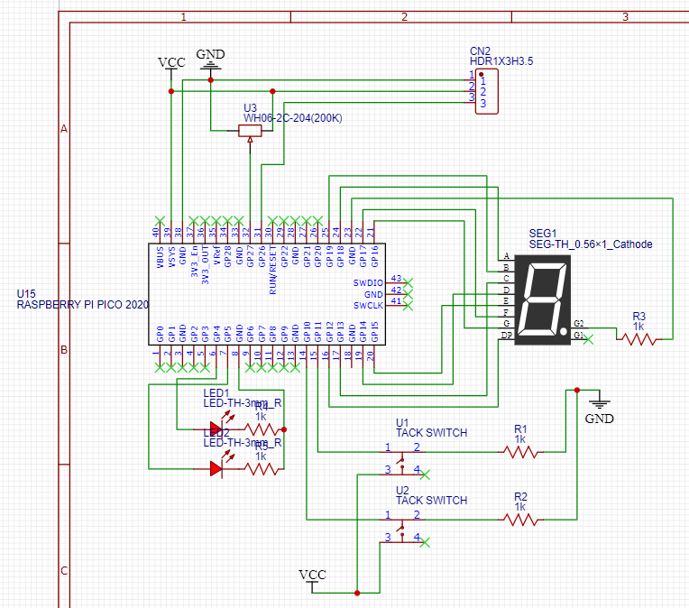
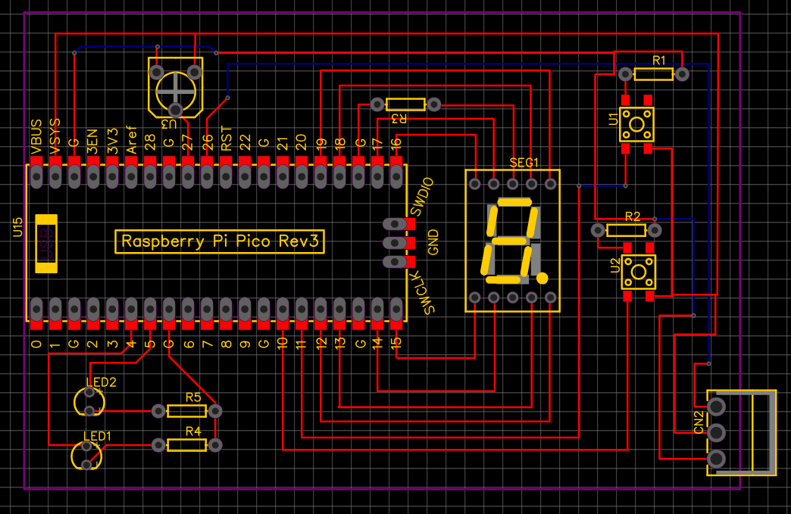

I made a microcontroller project to detect when my washing machine overflows. But I wasn't very happy with how sloppily the project box came together.

A few pcb manufacturing companies advertise heavily to my favorite youtube creators. So it seemed like a fun goal to make my own. <!--more-->

I wouldn't say I got the "hang" of easyEDA but I was able to figure out the basics 

But I was able to sort it out and then turn my design into a layout 

About 10 days later I got my PCBs. I _really_ didn't need 5 of them - but that's the minimum :)

Unfortunately I realized during shipping I forgot to include headers for the power input and the output wire to turn the outlet on/off.
So a hardware patch was going to be necessary.

I also needed to make a few software changes to re-route the wires to the 8-segment display to better respect a 2-d layout.

I made the software changes, soldered everything together. I then realized that on the PCB I had directly supplied 5v to the water sensor when I wanted to only supply power while taking readings (reviews suggested this would extend the life of the sensor).

So as I made the headers for the sensor I wired to an open GPIO port on the Raspberry Pi.
Then I added the header I forgot for power in and power-signal out.

I'm not actually sure if I want to even bother replacing my original version which is on a prototype breadboard with many wires taking up a lot of space. That all works so I hate to take it apart. And I don't necessarily need a 2nd sensor set up. But I'm very proud of getting a PCB made. I'm glad to have it as a hello-world project so I'll be ready when I get another microcontoller project.
