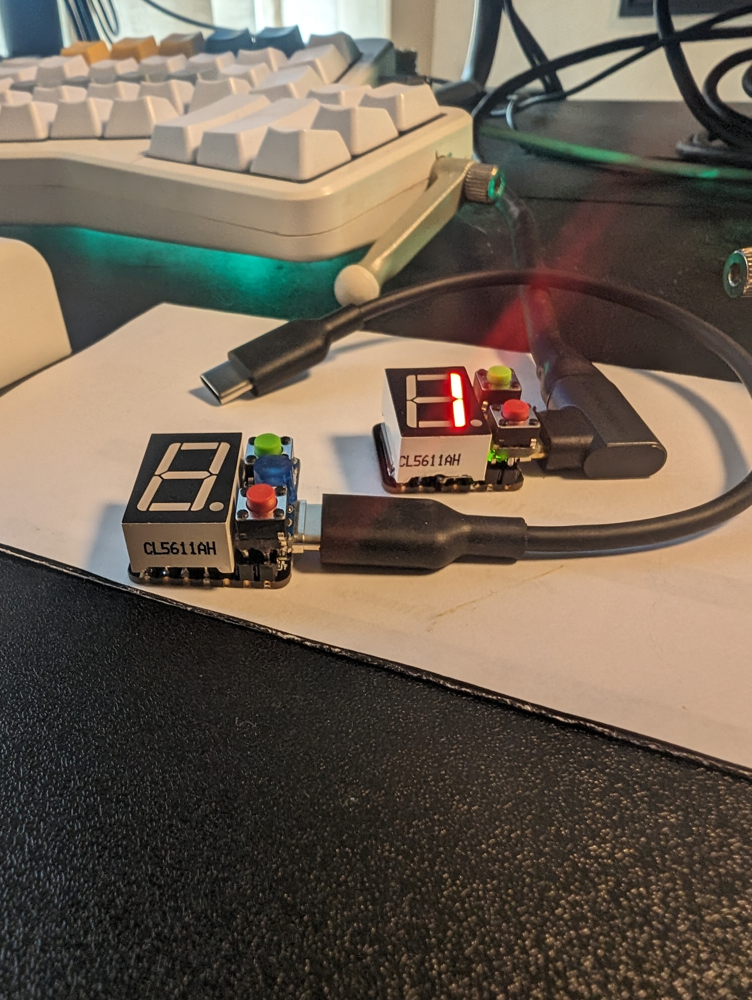
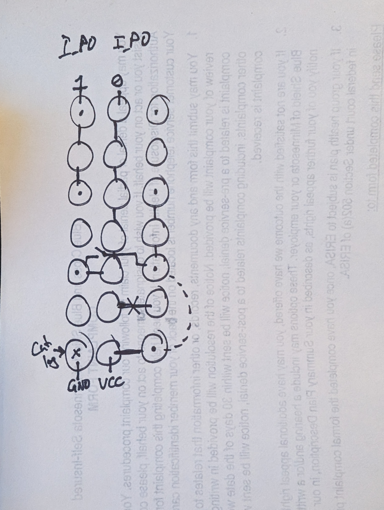
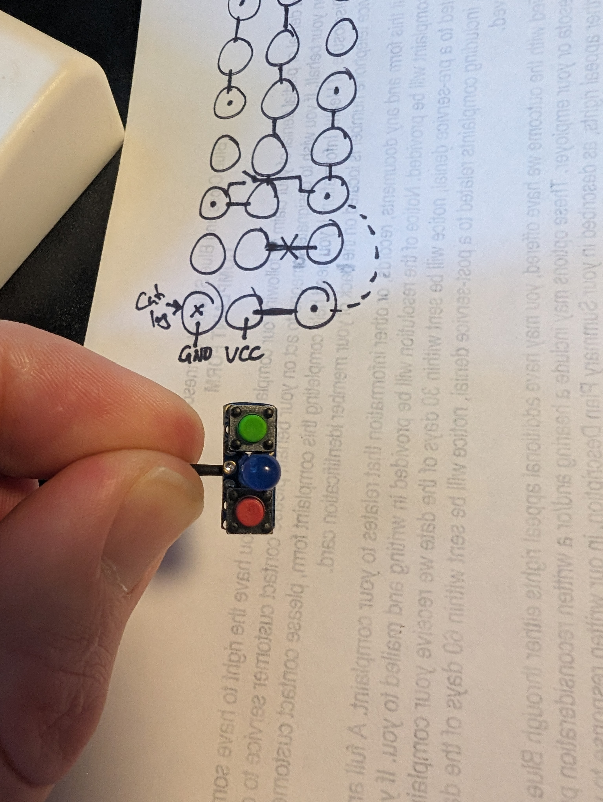
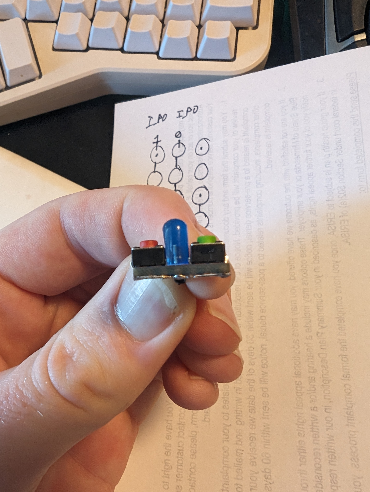
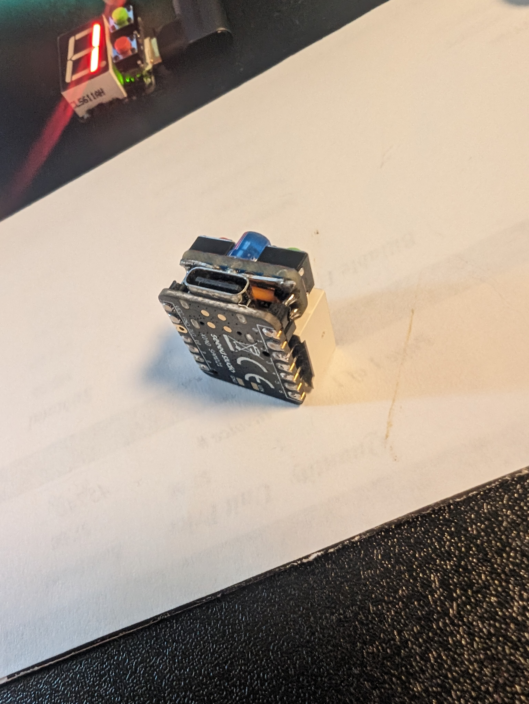

I made a small little counter/stopwatch with a microcontroller and an 8-segment display. I had some microcontrollers laying around and noticed the number of pins and physical size perfectly allowed an 8-segment display, two buttons, and a status LED. I came up with a little project with a satisfying form factor.

<!--more-->

I decided it would be a good idea to keep some microcontrollers around the house. When I ordered a PCB for my Washing Machine Project I ended up with a handful of 8-segment displays ([See the Washing Machine Post]() \| [See the PCB Post]()).

With the microcontroller and LED display sitting on my desk it finally clicked that the pin dimensions are nearly identical. The LED has two ground pins and only needs one. So if I cut one I can free up another GPIO pin. With pins 0/1 free I was able to tightly fit a small PCB next to the LED to fit two buttons.

To fit the wiring on the PCB I had to do a little planning and cutting the default traces on my breadboard PCB I used.

I didn't think about removing the 2nd ground pin on my first prototype. I tried to pull the pin out without desoldering the entire microcontroller and ended up messing up the pad - so v1 doesn't have the LED which v2 got.

I originally made a simple counter. Green to increment, red to decrement, hold both to reset to 0.  
In version two you can power on the device with the green button held to start in "counter" mode. But otherwise it boots into "stopwatch" mode.

In stopwatch mode the green button starts the timer. Red pauses. While paused green will resume and red will reset. (I didn't implement a lap function).

[Source Code](https://github.com/charliewynn/pocket_counter)

When using counter mode I write the value to the flash memory so you can power off the counter and keep your value when powering back on.

They nicely connect to my phone with a short usb-c to usb-c. My phone powers the device but doesn't seem to otherwise "notice" they're connected.
